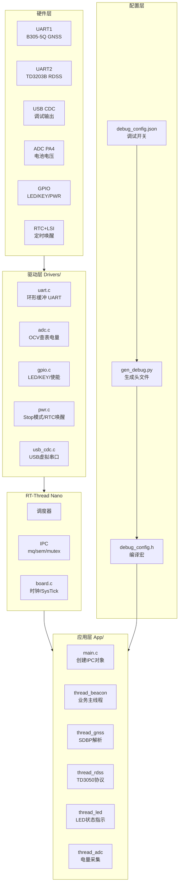
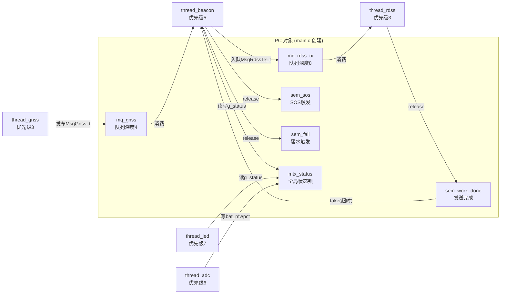
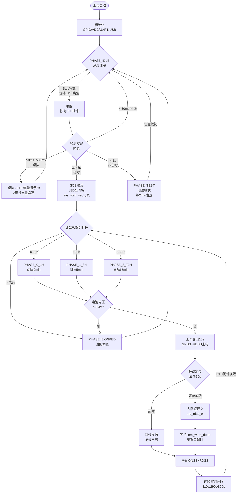
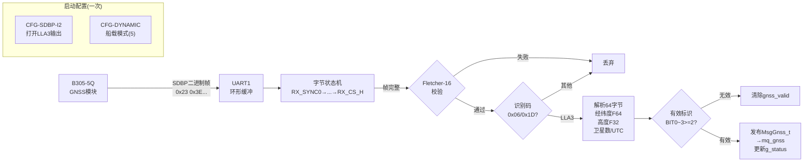
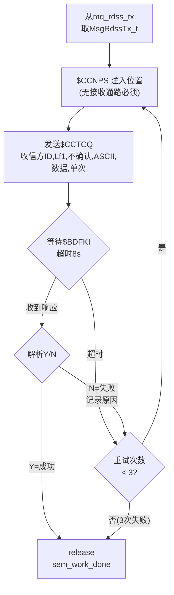
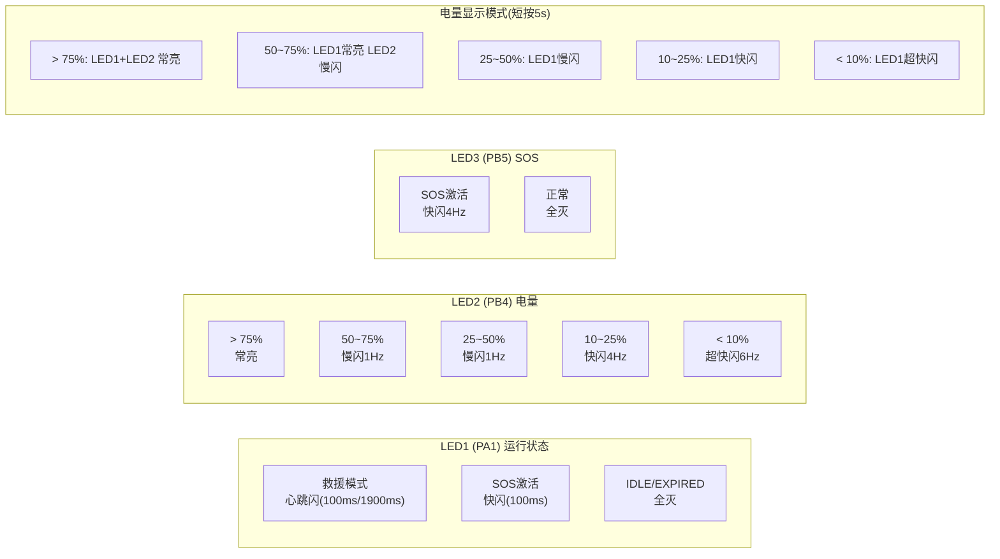
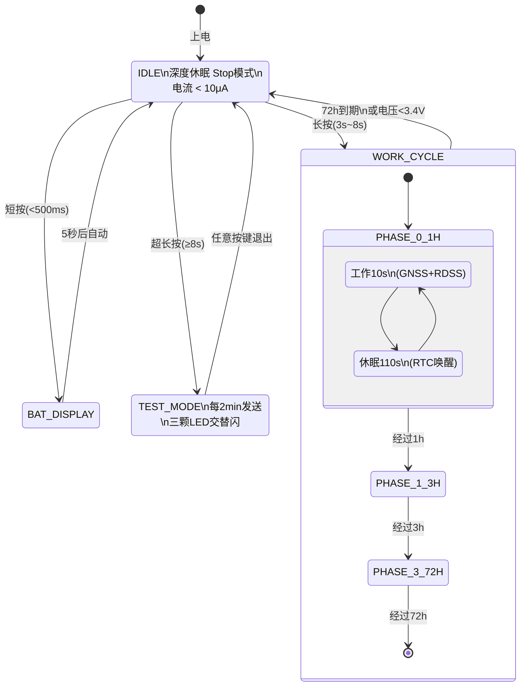
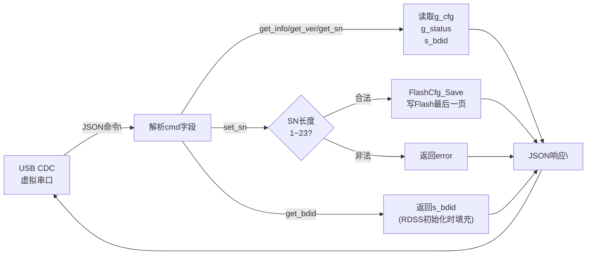
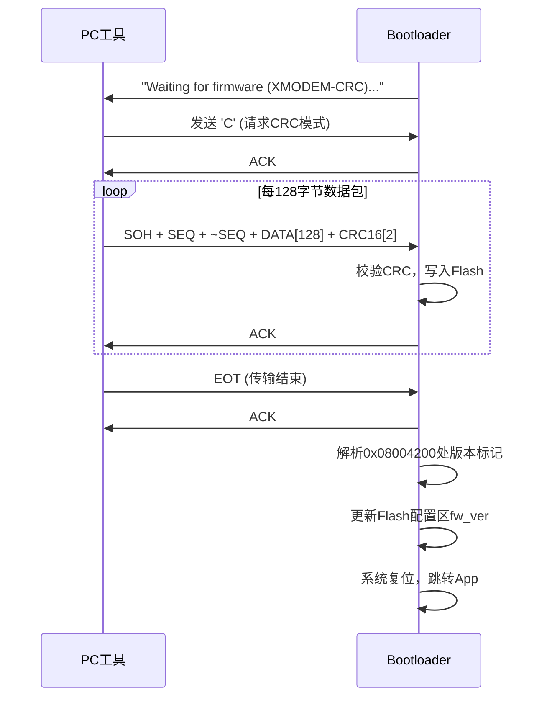
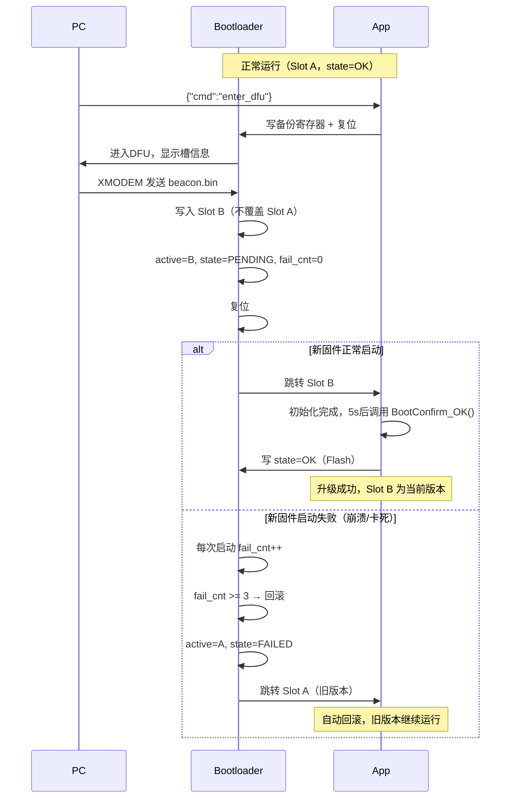

# 沈海渔示位标 固件架构与流程图

## 1. 整体软件架构



---

## 2. 线程与 IPC 关系



---

## 3. 主业务流程（thread_beacon）



---

## 4. GNSS 数据流（SDBP 协议）



---

## 5. RDSS 发送流程（TD3050 协议）



---

## 8. 按键时间定义

```
按住时长          动作
─────────────────────────────────────────
< 50ms           抖动，忽略
50ms ~ 500ms     短按 → LED电量显示5s后熄灭
500ms ~ 1s       忽略
1s ~ 3s          长按 → SOS救援模式激活（LED全闪5s）
3s ~ 8s          忽略
≥ 8s             超长按 → 测试模式（每2min发送，任意键退出）

按住渐进反馈：
  1s  → LED1亮（SOS即将触发提示）
  8s  → LED1+LED2+LED3全亮（测试模式确认）
```

## 9. 充电 PWM 呼吸流水

```
软件PWM参数：
  线程周期：10ms
  PWM级数：32步（0=灭, 31=最亮）
  每颗LED呼吸：渐亮32步(320ms) + 保持8步(80ms) = 400ms
  全灭间隔：16步(160ms)

以80%电量为例（max_led=3）：
  ┌─────────────────────────────────────────────────────┐
  │ LED1: ░░▒▒▓▓██ → 保持 │                             │
  │ LED2:           ░░▒▒▓▓██ → 保持 │                   │
  │ LED3:                     ░░▒▒▓▓██ → 保持 │ 全灭 │  │
  └─────────────────────────────────────────────────────┘
  总周期 = 3×400ms + 160ms = 1360ms，循环

电量与流水颗数：
  0~33%:  只有LED1呼吸循环
  33~66%: LED1→LED2 依次呼吸循环
  66~95%: LED1→LED2→LED3 依次呼吸循环
  ≥95%:   3颗常亮（充满）
```



---

## 7. 低功耗状态转换



## 10. USB 配置接口 (thread_config)

### 连接方式
插入 Type-C USB，电脑识别为 CDC 虚拟串口，用任意串口工具连接（波特率无关）。

### 命令格式
每条命令为一行 JSON，以 `\n` 结尾：

| 命令 | 说明 |
|------|------|
| `{"cmd":"get_info"}` | 获取所有信息（版本/SN/UID/北斗卡号/电量） |
| `{"cmd":"get_sn"}` | 读取产品SN |
| `{"cmd":"set_sn","sn":"SHY-2026-000001"}` | 写入SN并保存到Flash |
| `{"cmd":"get_uid"}` | 读取16位唯一识别码 |
| `{"cmd":"set_uid","uid":"A1B2C3D4E5F60001"}` | 写入16位唯一识别码（大写HEX，出厂时设置） |
| `{"cmd":"get_bdid"}` | 读取北斗卡号（需RDSS模块已初始化） |
| `{"cmd":"get_status"}` | 读取运行状态 |
| `{"cmd":"get_ver"}` | 读取固件版本(只读)和硬件版本 |
| `{"cmd":"set_hw_ver","hw_ver":"1.0.0"}` | 写入硬件版本到Flash（出厂时设置） |

### Flash 配置区布局
```
地址: 0x0801FC00 (最后一页 1KB, N32L403 128KB Flash)

偏移  大小  内容
0x00  4B    magic = 0xBEAC0001
0x04  24B   sn[24]  产品序列号 (如 SHY-2026-000001)
0x1C  4B    hw_ver[4] 硬件版本 major.minor.patch.rsvd
0x20  17B   uid[17] 16位唯一识别码 (如 A1B2C3D4E5F60001)
0x31  3B    rsvd 对齐保留
0x34  4B    crc32 (CRC32校验)
```

### get_info 响应示例
```json
{"ok":true,"product":"ShenHaiYu-Beacon","fw_ver":"V1.0.0","hw_ver":"1.0.0","sn":"SHY-2026-000001","uid":"A1B2C3D4E5F60001","bdid":"88888888","bat_mv":4050,"bat_pct":83,"usb":true}
```

### 线程信息
```
线程名: config
优先级: 6
栈大小: 512B
依赖:   USB CDC, Flash, mtx_status, g_cfg
```



## 11. Bootloader

### Flash 内存布局
```
地址范围                  大小    内容
─────────────────────────────────────────────────────
0x08000000 ~ 0x08003FFF   16KB   Bootloader
0x08004000 ~ 0x0801BFFF  112KB   Application
0x0801C000 ~ 0x0801FBFF   16KB   保留
0x0801FC00 ~ 0x0801FFFF    1KB   Flash 配置区 (SN/UID/版本)

固件版本标记（供Bootloader解析）：
0x08004200  8B  "VERS" + major + minor + patch + 0x00
```

### 进入 DFU 模式的方式
```
1. 上电时按住 PB7 (SOS键) → 直接进入
2. USB命令 {"cmd":"enter_dfu"} → 写备份寄存器后复位进入
3. App 区无有效固件 → 自动进入
```

### DFU 下载流程（XMODEM-CRC）


### PC 端下载工具
```powershell
# 方式1：命令行 (需安装 lrzsz 或 minicom)
# 先发送 enter_dfu 命令，然后用 sx 发送
echo '{"cmd":"enter_dfu"}' > COMx
sx -k firmware.bin < COMx > COMx

# 方式2：使用 tools/dfu_tool.py
cd tools
python dfu_tool.py --port COM3 --file ../firmware/build/beacon.bin
```

### 软件版本更新机制
```
编译时：FW_VERSION_MARKER() 宏在 0x08004200 写入版本号
下载时：Bootloader 读取该地址，解析 major.minor.patch
完成后：写入 Flash 配置区 rsvd[0~2]
查询时：App 通过 get_ver 命令返回配置区中的版本号
```

### 版本号汇总
| 版本 | 存储位置 | 修改方式 | 命令 |
|------|----------|----------|------|
| 软件版本 fw_ver | Flash 0x08004200 + 配置区 | 重新编译烧录 | get_ver (只读) |
| 硬件版本 hw_ver | Flash 配置区 0x0801FC1C | USB set_hw_ver | get_ver / set_hw_ver |
| 产品SN | Flash 配置区 0x0801FC04 | USB set_sn | get_sn / set_sn |
| 唯一UID | Flash 配置区 0x0801FC20 | USB set_uid | get_uid / set_uid |

## 12. 调试工作流

### 阶段一：纯 App 调试（推荐前期使用）

不需要 Bootloader，ST-Link 直接烧录整个 Flash。

**步骤：**
1. 修改 `debug_config.json`，设置 `"USE_BOOTLOADER": false`
2. `make all` — gen_debug.py 自动将链接脚本改为 `0x08000000 / 128K`
3. `make flash` — ST-Link 烧录
4. 插 Type-C，打开串口工具看日志

```json
// debug_config.json 调试模式
{
  "options": {
    "USE_BOOTLOADER": false,
    "LOG_LEVEL": 3
  }
}
```

### 阶段二：Bootloader + App 联调

**首次烧录（只需一次）：**
```powershell
cd bootloader
make all
make flash        # 烧录到 0x08000000
```

**切换到 Bootloader 模式：**
1. 修改 `debug_config.json`，设置 `"USE_BOOTLOADER": true`
2. `make all` — 链接脚本自动改为 `0x08004000 / 112K`
3. `make flash` — 烧录 App 到 0x08004000

**后续 App 更新（无需 ST-Link）：**
```powershell
# 方式1：USB命令触发
echo '{"cmd":"enter_dfu"}' | 串口工具发送

# 方式2：上电按住 PB7
# 然后用 XMODEM 发送 bin 文件
python tools/dfu_tool.py --port COM3 --file firmware/build/beacon.bin
```

### 链接脚本自动切换原理

```
debug_config.json
  USE_BOOTLOADER: false  →  FLASH ORIGIN=0x08000000 LENGTH=128K
  USE_BOOTLOADER: true   →  FLASH ORIGIN=0x08004000 LENGTH=112K
```

`make all` 时 `gen_debug.py` 自动修改 `n32l403.ld`，无需手动改文件。

### 调试建议

| 场景 | 配置 | 说明 |
|------|------|------|
| 功能开发 | USE_BOOTLOADER=false, LOG_LEVEL=3 | 最快迭代，全日志 |
| 模块单测 | 对应模块=true，其他=false | 减少日志噪音 |
| 性能测试 | LOG_LEVEL=0 | 关闭所有日志 |
| 出厂固件 | USE_BOOTLOADER=true, LOG_LEVEL=0 | 完整功能，无日志 |
| Bootloader联调 | USE_BOOTLOADER=true, LOG_LEVEL=2 | 验证升级流程 |

## 13. A/B 双分区防变砖机制

### Flash 布局（更新后）
```
地址范围                  大小    内容
─────────────────────────────────────────────────────
0x08000000 ~ 0x08003FFF   16KB   Bootloader
0x08004000 ~ 0x0800FFFF   48KB   App Slot A（当前运行）
0x08010000 ~ 0x0801BFFF   48KB   App Slot B（备份/升级目标）
0x0801C000 ~ 0x0801EFFF   12KB   保留
0x0801F000 ~ 0x0801F7FF    2KB   Boot Flag（升级状态区）
0x0801F800 ~ 0x0801FFFF    2KB   Flash 配置区（SN/UID/版本）
```

### Boot Flag 结构
```c
typedef struct {
    uint32_t magic;          // 0xB007F1A6
    uint8_t  active_slot;    // 当前运行槽 0=A, 1=B
    uint8_t  upgrade_slot;   // 升级目标槽
    uint8_t  upgrade_state;  // 0x00=IDLE, 0xAA=PENDING, 0x55=OK, 0xFF=FAILED
    uint8_t  boot_fail_cnt;  // 连续启动失败次数
    uint8_t  slot_a_ver[3];  // Slot A 版本 major.minor.patch
    uint8_t  slot_b_ver[3];  // Slot B 版本
    uint32_t crc32;
} BootFlag_t;
```

### 升级与回滚流程



### 手动回滚

在 DFU 模式下按 `R` 键立即切换到另一个槽：
```
=== ShenHaiYu Beacon Bootloader BL1.0.0 ===
Slot A: OK  V1.0.0
Slot B: OK  V1.1.0
Active: Slot B

Send firmware via XMODEM-CRC, or:
  'Q' = boot current app
  'R' = rollback to previous slot
```

### 防变砖保证

| 场景 | 结果 |
|------|------|
| 下载中断/失败 | 旧槽完整，直接启动旧版本 |
| 新固件启动崩溃 | 3次后自动回滚旧槽 |
| 新固件卡死（未确认） | 3次后自动回滚旧槽 |
| 两个槽都损坏 | 强制进入DFU等待下载 |
| 手动回滚 | DFU模式按'R'立即切换 |

## 14. 编译产物与内存占用

### 当前编译结果

```
App 固件 (beacon.elf)          Bootloader (bootloader.elf)
─────────────────────────      ──────────────────────────
text :  14604 B (14.3KB)       text :  8760 B (8.6KB)
data :    124 B                data :   100 B
bss  :   2076 B (2.0KB)        bss  :   824 B
─────────────────────────      ──────────────────────────
Flash:  14728 B (14.4KB)       Flash:  8860 B (8.7KB)
RAM  :   2200 B ( 2.1KB)       RAM  :   924 B (0.9KB)
```

### 空间余量

| 区域 | 已用 | 分配 | 剩余 | 占用率 |
|------|------|------|------|--------|
| App Flash (Slot A) | 14.4KB | 48KB | 33.6KB | 30% |
| App RAM | 2.1KB* | 32KB | ~20KB | — |
| Bootloader Flash | 8.7KB | 16KB | 7.3KB | 54% |
| Bootloader RAM | 0.9KB | 8KB | 7.1KB | 11% |

> *App RAM 静态占用 2.1KB，RT-Thread 线程栈和堆动态分配约 8~12KB，总计约 10~14KB，32KB 充裕。

### 各段说明

```
text  = 机器码 + 只读常量（字符串、查表数据等）→ 烧录到 Flash
data  = 有初始值的全局变量 → 初始值存 Flash，运行时复制到 RAM
bss   = 无初始值的全局变量（启动时清零）→ 仅占 RAM
```

### RT-Thread 内存分布（App）

```
RAM 0x20000000
├── .data   (124B)   有初始值全局变量
├── .bss    (2076B)  无初始值全局变量 + RT-Thread 堆(8KB)
│   ├── g_status     设备状态结构
│   ├── g_cfg        Flash配置缓存
│   ├── IPC对象      mq/sem/mutex
│   └── 线程栈       5线程 × 256~512B
└── 栈顶 0x20008000
```

## 15. DMA 使用说明

### 设计决策

| 外设 | 方向 | 方式 | 原因 |
|------|------|------|------|
| UART1 RX (GNSS) | 外设→内存 | **DMA 循环** | GNSS 连续输出，CPU 零参与 |
| UART2 RX (RDSS) | 外设→内存 | **DMA 循环** | 短报文响应需及时接收 |
| UART1/2 TX | 内存→外设 | 轮询 | 发送频率极低，无需 DMA |
| UART3 RX (调试) | 外设→内存 | RXNE 中断 | 数据量小，中断足够 |
| ADC | — | 软件触发轮询 | 每10s采一次，等待时间<1ms |

### DMA 通道分配

```
DMA1 Channel 5 → USART1_RX (GNSS,  PA10)
DMA1 Channel 6 → USART2_RX (RDSS,  PA0)
```

### 工作原理

```
GNSS模块 → PA10 → USART1_DR → DMA1_CH5 → s_dma_buf1[256]
                                              ↑ 循环覆盖
SysTick(1ms) → UART_DMA_Poll()
                  → 计算 CNDTR 变化量
                  → 搬运新数据到 s_rxbuf[CH1][512]
                  → thread_gnss 从环形缓冲读取
```

### 内存占用

```
s_dma_buf1[256]  USART1 DMA 硬件缓冲（需4字节对齐）
s_dma_buf2[256]  USART2 DMA 硬件缓冲
s_rxbuf[0][512]  UART1 软件环形缓冲
s_rxbuf[1][512]  UART2 软件环形缓冲
s_rxbuf[2][512]  UART3 软件环形缓冲
总计: 2KB
```

### 改造前后对比

| 指标 | 改造前（中断） | 改造后（DMA） |
|------|--------------|--------------|
| CPU 中断频率 | 每字节一次（9600bps≈960次/s） | 0（DMA自动搬运） |
| 延迟 | 中断响应延迟 | 最大 1ms（SysTick周期） |
| 丢包风险 | 中断被屏蔽时丢包 | DMA 硬件缓冲保护 |
| 代码复杂度 | 低 | 略高（CNDTR计算） |

## 16. USB DMA 评估报告

### 硬件架构限制

N32L403 的 USB 控制器使用独立的 **Packet Buffer SRAM（PMA）**，地址 `0x40006000`，
挂载在 APB1 总线上，**不在 AHB 总线上**。

```
CPU  ←→  AHB  ←→  SRAM(0x20000000)
                ↕
              APB1
                ↕
           USB PMA(0x40006000)  ←→  USB物理层
```

**DMA 控制器只能访问 AHB 总线上的内存，无法直接访问 PMA。**
因此 USB 数据搬运必须由 CPU 完成，这是硬件架构决定的，**无法用 DMA 改造**。

### App USB 评估

| 方面 | 当前实现 | 评估 |
|------|----------|------|
| TX 路径 | 环形缓冲 → 中断触发 → CPU 搬运到 PMA | ✅ 已最优，中断驱动无阻塞 |
| RX 路径 | USB中断 → CPU 从 PMA 读取 → 环形缓冲 | ✅ 已最优 |
| TX 缓冲 | 512 字节软件环形缓冲 | ✅ 足够 |
| RX 缓冲 | 256 字节软件环形缓冲 | ✅ 足够（JSON命令最长128字节） |
| 发送方式 | EP1 Bulk IN，64字节/包，中断完成后继续 | ✅ 标准CDC实现 |
| CPU 占用 | 仅在 USB 中断时（数据到达/发送完成）| ✅ 极低 |

**结论：App USB 无需改造，当前实现已是该硬件架构下的最优方案。**

### Bootloader USB 评估

| 方面 | 当前实现 | 评估 |
|------|----------|------|
| 使用场景 | 仅 DFU 模式下使用 | 低频使用 |
| 数据量 | XMODEM 128字节/包，约 48KB/包数=384包 | 小 |
| TX | 轮询等待 TXE | ✅ DFU场景可接受 |
| RX | 轮询读取 | ✅ DFU场景可接受 |

**结论：Bootloader USB 无需改造，DFU 场景对性能无要求。**

### USB 与 DMA 对比总结

```
外设          DMA可用？  原因
──────────────────────────────────────────────────
UART1 RX      ✅ 已改    AHB总线，DMA可直接访问
UART2 RX      ✅ 已改    AHB总线，DMA可直接访问
USB TX/RX     ❌ 不可用  PMA在APB1，DMA无法访问
ADC           ❌ 无收益  采样频率极低(每10s一次)
```

### USB 传输性能参考

```
USB Full-Speed: 12Mbps 理论带宽
CDC Bulk EP:    64字节/包
实际吞吐:       约 1MB/s（受主机轮询间隔限制）

本项目使用场景：
  调试日志输出：< 1KB/s，远低于USB带宽
  DFU固件下载：48KB固件，约0.05秒传输完成
  JSON配置命令：< 256字节/次，瞬时完成
```

## 16. USB DMA 评估

### 结论：USB 无需 DMA，已是最优架构

N32L403 的 USB Full-Speed 控制器使用 **Packet Buffer Memory（PMA）** 机制：

```
主机 ←→ USB物理层 ←→ PMA(512B专用SRAM) ←→ CPU
                        ↑
                   硬件自动搬运
                   无需DMA介入
```

PMA 是 USB 控制器的专用 SRAM，数据传输由 USB 硬件自动完成，CPU 只需在中断里读写 PMA，这本身就等同于 DMA 的效果。

### 各外设 DMA/中断 使用汇总

| 外设 | 方向 | 机制 | CPU 参与度 |
|------|------|------|-----------|
| UART1 RX (GNSS) | 外设→内存 | DMA1 CH5 循环 | 零（SysTick搬运） |
| UART2 RX (RDSS) | 外设→内存 | DMA1 CH6 循环 | 零（SysTick搬运） |
| UART1/2 TX | 内存→外设 | 轮询 | 低（发送频率极低） |
| UART3 RX (调试) | 外设→内存 | RXNE 中断 | 低（数据量小） |
| USB EP1 TX | PMA→主机 | USB硬件+中断 | 低（填充PMA） |
| USB EP2 RX | 主机→PMA | USB硬件+中断 | 低（读取PMA） |
| ADC | — | 软件触发轮询 | 极低（<1ms/次） |
| Flash R/W | — | CPU直接访问 | 仅升级时 |

## 17. 代码优化记录

### 本次优化内容

| 问题 | 位置 | 修复方案 |
|------|------|----------|
| Flash写入无中断保护 | boot_confirm.c | 写Flash前后加 cpsid/cpsie |
| DMA Poll与线程竞态 | uart.c | 分析确认单向写入无竞态，加注释说明 |
| GNSS无重试机制 | thread_beacon.c | 最多重试3次，每次10s |
| 测试模式无超时 | thread_beacon.c | 加72h超时自动退出 |
| 测试模式static变量不重置 | thread_beacon.c | 进入时记录 sos_start_sec |
| 充电时电量显示虚高 | adc.c | 充电状态补偿-80mV再查表 |
| enter_dfu未安全退出 | thread_config.c | 先关外设等500ms再复位 |
| USB SendByte无限忙等 | usb_cdc.c | 改为有限次NOP等待，超时丢弃 |

### GNSS 定位重试逻辑

```
工作窗口(最多30s = 3次×10s)：
  第1次: 等待10s → 有定位 → 发报文
  第2次: 等待10s → 有定位 → 发报文
  第3次: 等待10s → 无定位 → 跳过发报文，记录日志
```

### 充电电量补偿

```
充电时：V_measured = V_battery + I_charge × R_internal
补偿：  V_corrected = V_measured - 80mV
查表：  SOC = OCV_table(V_corrected)

80mV 对应约 100mA × 0.8Ω 内阻（450mAh 锂电池典型值）
```

## 18. 代码质量最终确认

### 本轮修复清单

| # | 问题 | 严重度 | 修复方案 |
|---|------|--------|----------|
| 1 | ADC查表除零（mv==v_hi时分母为0） | 🔴 | 精确匹配直接返回，跳过插值 |
| 2 | ADC过采样无去极值 | 🟡 | 改为16次采样排序后去掉最大最小各2个，取中间12个均值 |
| 3 | GNSS帧长超限未清空缓冲 | 🔴 | 超限时清空s_data和s_idx再重置状态机 |
| 4 | GNSS配置命令无等待 | 🟡 | 发送后加200ms延迟等待模块处理 |
| 5 | RDSS位置注入负数经纬度错误 | 🔴 | 用fabs处理绝对值，方向字符单独判断 |
| 6 | 测试模式static变量不重置 | 🔴 | 改为文件级变量，进入时调用ResetTestTimer()清零 |
| 7 | 测试模式无超时保护 | 🟡 | 加72h超时自动退出 |
| 8 | 低电量条件逻辑顺序错误 | 🟡 | 改为先判断bat_mv>0再判断<阈值 |
| 9 | DMA缓冲溢出无告警 | 🟡 | 加s_rb_overflow[]计数器，提供UART_GetOverflow()接口 |
| 10 | enter_dfu未安全退出 | 🟡 | 先关外设等500ms，关中断后再复位 |
| 11 | USB SendByte无限忙等 | 🟡 | 改为有限NOP等待，超时丢弃 |
| 12 | Flash写入无中断保护 | 🔴 | 写Flash前后加cpsid/cpsie |

### 当前代码质量评估

| 维度 | 评分 | 说明 |
|------|------|------|
| 功能完整性 | ★★★★☆ | 核心功能齐全，边界情况已处理 |
| 防变砖可靠性 | ★★★★★ | A/B双分区+3次失败回滚+手动回滚 |
| 低功耗设计 | ★★★★☆ | Stop模式+RTC唤醒，DMA零CPU接收 |
| 代码健壮性 | ★★★★☆ | 竞态已分析，关键路径有保护 |
| 可调试性 | ★★★★★ | JSON配置接口+分级日志+溢出计数 |

### 已知局限（不影响功能，后续可改进）

- LED PWM 用软件模拟，精度受 10ms 线程周期限制，可改用 TIM3 硬件 PWM
- GNSS 配置命令无 ACK 确认，依赖延迟等待，可改为解析 SDBP-PUB-ACK 响应
- 短报文无入站确认（$BDACK），只判断发射成功，无法确认对方收到
